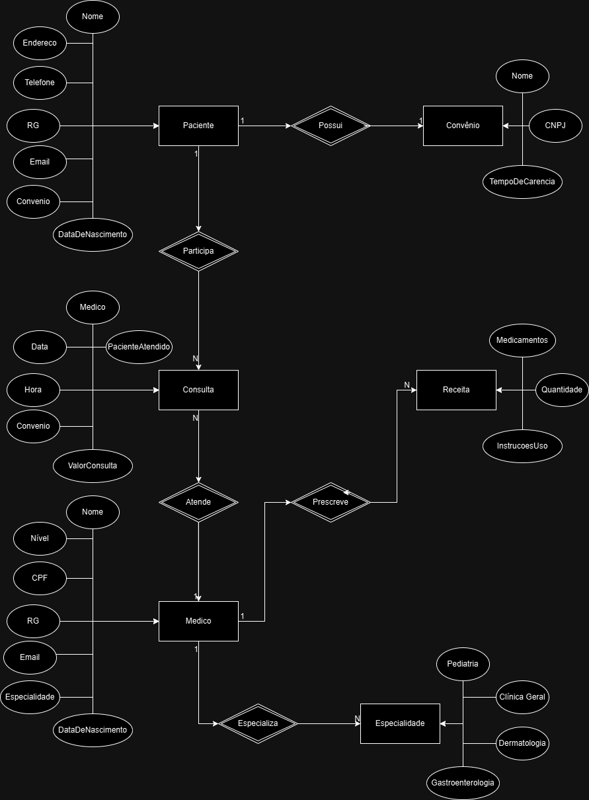

## HOSPITAL DATABASE

<h4>Solicitação Cliente</h4>
O hospital necessita de um sistema para a área clínica que ajude a controlar consultas realizadas. Os médicos podem ser generalistas, especialistas ou residentes e têm seus dados pessoais cadastrados em planilhas digitais. Cada médico pode ter uma ou mais especialidades (pediatria, clínica geral, gastroenterologia e dermatologia). Alguns registros antigos ainda estão em formulários de papel, e será necessário incluí-los no novo sistema. Os pacientes precisam de cadastro, contendo: nome, data de nascimento, endereço, telefone, e-mail, CPF e RG. Cada paciente pode estar vinculado a um convênio (nome, CNPJ, tempo de carência). As consultas são registradas com data e hora, médico responsável, paciente, valor da consulta ou nome do convênio (com o número da carteira). Também é necessário indicar a especialidade buscada pelo paciente. O sistema deve permitir que, ao encerrar uma consulta, o médico registre a receita médica, incluindo os medicamentos receitados, quantidade e instruções de uso. A partir disso, o sistema deve permitir imprimir ou visualizar a receita online.
<h4>Resultado</h4>
