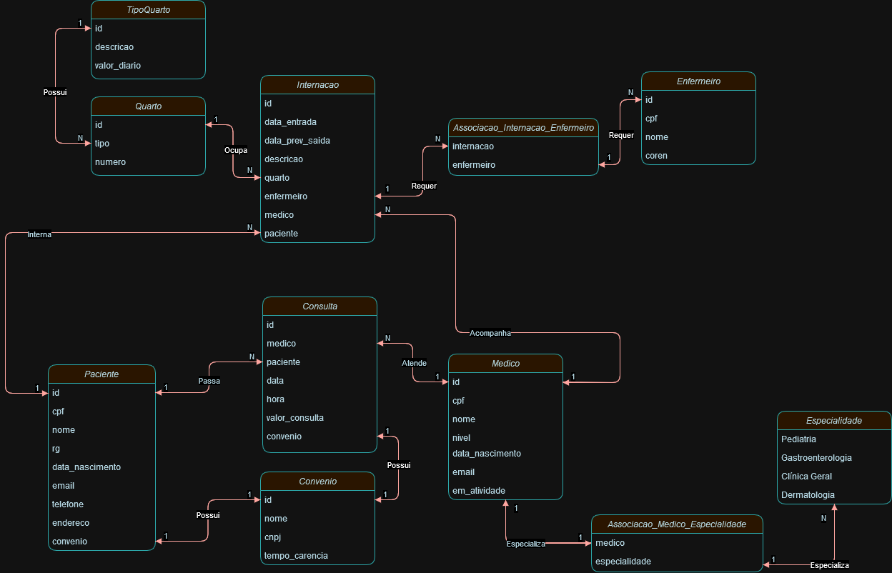

## HOSPITAL DATABASE

<h4>Solicitação Cliente</h4>
Pensando no banco que já foi criado para o Projeto do Hospital, realize algumas alterações nas tabelas e nos dados usando comandos de atualização e exclusão:

Crie um script que adicione uma coluna “em_atividade” para os médicos, indicando se ele ainda está atuando no hospital ou não. 

Crie um script para atualizar ao menos dois médicos como inativos e os demais em atividade.
<h4>Resultado</h4>


```
USE Hospital;

ALTER TABLE Medico ADD COLUMN em_atividade bool NOT NULL DEFAULT true;

UPDATE Medico SET em_atividade = false WHERE id = '123456';
UPDATE Medico SET em_atividade = false WHERE id = '678368';

SELECT * FROM Medico;
```