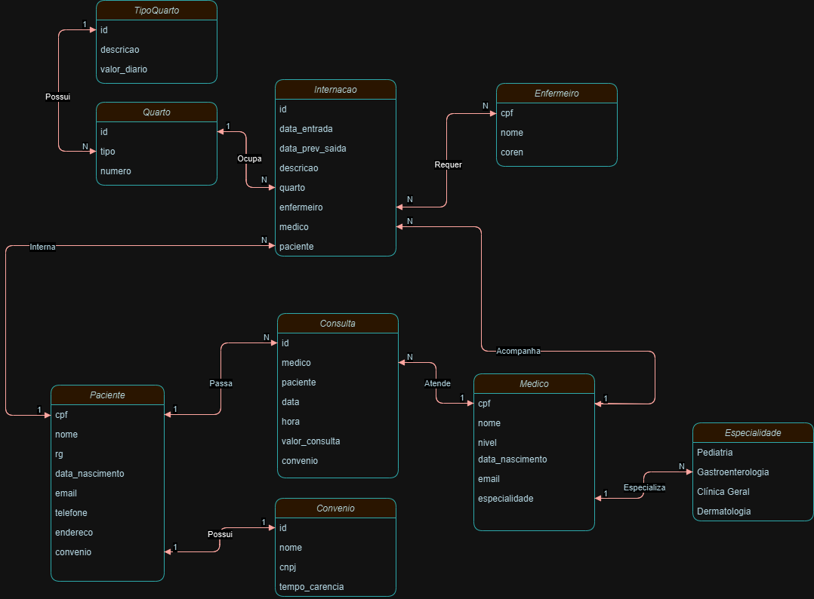

# Hospital Database

Bem-vindo ao centro de organização da migração dos dados do Hospital Albert Einstein para o banco de dados. A seguir, estão as etapas seguidas no processo de migração dos dados, com detalhes de cada fase.

## 1. Migração Inicial

### Dados

O hospital necessita de um sistema para a área clínica que ajude a controlar consultas realizadas. Os médicos podem ser generalistas, especialistas ou residentes e têm seus dados pessoais cadastrados em planilhas digitais. Cada médico pode ter uma ou mais especialidades (pediatria, clínica geral, gastroenterologia e dermatologia). Alguns registros antigos ainda estão em formulários de papel, e será necessário incluí-los no novo sistema.
Os pacientes precisam de cadastro, contendo: nome, data de nascimento, endereço, telefone, e-mail, CPF e RG. Cada paciente pode estar vinculado a um convênio (nome, CNPJ, tempo de carência).
As consultas são registradas com data e hora, médico responsável, paciente, valor da consulta ou nome do convênio (com o número da carteira). Também é necessário indicar a especialidade buscada pelo paciente.
O sistema deve permitir que, ao encerrar uma consulta, o médico registre a receita médica, incluindo os medicamentos receitados, quantidade e instruções de uso. A partir disso, o sistema deve permitir imprimir ou visualizar a receita online.

### Resultado Esperado


## 2. Migração de Internações

### Dados
No hospital, as internações têm sido registradas por meio de formulários eletrônicos que gravam os dados em arquivos. 
Para cada internação, são anotadas a data de entrada, a data prevista de alta e a data efetiva de alta, além da descrição textual dos procedimentos a serem realizados. 
As internações precisam ser vinculadas a quartos, com a numeração e o tipo. 
Cada tipo de quarto tem sua descrição e o seu valor diário (a princípio, o hospital trabalha com apartamentos, quartos duplos e enfermaria).
Também é necessário controlar quais profissionais de enfermaria estarão responsáveis por acompanhar o paciente durante sua internação. Para cada enfermeiro(a), é necessário nome, CPF e registro no conselho de enfermagem (COREN).
A internação, obviamente, é vinculada a um paciente – que pode se internar mais de uma vez no hospital – e a um único médico responsável.

### Resultado Esperado 



<h4>Código:</h4></br>

```
CREATE TABLE IF NOT EXISTS Paciente(
	cpf INTEGER PRIMARY KEY NOT NULL,
	nome Varchar(80) Not NULL,
	rg Varchar(10) NOT NULL,
	data_nascimento DATE NOT NULL,
	email Varchar(80) NOT NULL,
	telefone Varchar(11) NOT NULL,
	endereco Varchar(100) NOT NULL, 
	convenio INT,
	FOREIGN KEY (convenio) REFERENCES Convenio(id)
);

CREATE TABLE IF NOT EXISTS  Convenio (
	id INTEGER PRIMARY KEY NOT NULL,
	nome Varchar(80) NOT NULL, 
	cpnj Varchar(14) NOT NULL,
	tempo_carencia INTEGER NOT NULL
);

CREATE TABLE IF NOT EXISTS Medico (
	cpf INTEGER PRIMARY KEY NOT NULL,
  	nome Varchar(80) NOT NULL,
  	nivel INTEGER NOT NULL,
  	data_nascimento DATE NOT NULL,
  	email Varchar(80) NOT NULL,
  	especialidade INT,
  	FOREIGN KEY (especialidade) REFERENCES Especialidade(id)
);
  
 CREATE TABLE IF NOT EXISTS Especialidade (
	id SERIAL PRIMARY KEY,
	nome Varchar(80) NOT NULL
);

CREATE TABLE IF NOT EXISTS Consulta (
	id INTEGER PRIMARY KEY NOT NULL,
  	data_consulta DATE NOT NULL,
  	hora_consulta TIME NOT NULL, 
  	valor_consulta DOUBLE NOT NULL DEFAULT 0.00,
 	medico INT,
  	paciente INT,
  	convenio INT,
  	FOREIGN KEY (medico) REFERENCES Medico(cpf),
  	FOREIGN KEY (convenio) REFERENCES Convenio(id),
  	FOREIGN KEY (paciente) REFERENCES Paciente(cpf)
);

CREATE TABLE IF NOT EXISTS Internacao (
	id INTEGER PRIMARY KEY NOT NULL,
  	data_entrada DATE NOT NULL, 
  	data_prev_saida DATE NOT NULL,
  	descricao TEXT NOT NULL,
  	quarto INT, 
  	enfermeiro INT,
  	medico INT,
  	paciente INT,
  	FOREIGN KEY (quarto) REFERENCES QUARTO(id),
  	FOREIGN KEY (medico) REFERENCES Medico(cpf),
  	FOREIGN KEY (enfermeiro) REFERENCES Enfermeiro(cpf),
  	FOREIGN KEY (paciente) REFERENCES Paciente(cpf)
);

CREATE TABLE IF NOT EXISTS Enfermeiro (
	cpf INTEGER PRIMARY KEY NOT NULL, 
  	nome Varchar(80) NOT NULL,
  	coren INTEGER NOT NULL
);

CREATE TABLE IF NOT EXISTS Quarto (
	id INTEGER PRIMARY KEY NOT NULL,
  	numero INTEGER NOT NULL,
  	tipo INT,
  	FOREIGN KEY (tipo) REFERENCES TipoQuarto(id)
);

CREATE TABLE IF NOT EXISTS TipoQuarto (
	id SERIAL PRIMARY KEY NOT NULL,
  	tipo Varchar(80) NOT NULL,
  	descricao TEXT,
  	valor_diaria DOUBLE not NULL DEFAULT 0.00
);
```
